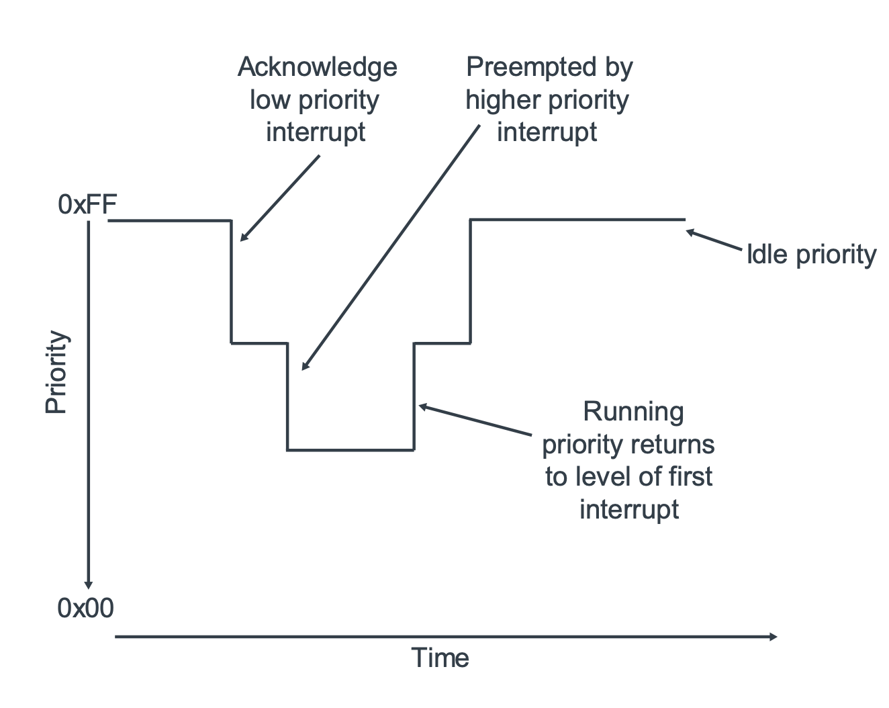

# GIC

[[toc]]

## Registers

### Distributor (GICD_*)

### Redistributors (GICR_*)

### CPU interfaces (ICC_*_ELn)


## Lift cycle of an interrupt

### Level-sensitive interrupts

For level-sensitive interrupts, a rising edge on the interrupt input
causes the interrupt to become pending, and the interrupt is held
asserted **until the peripheral de-asserts the interrupt signal**.

```
+-> Inactive
|     |
|     | interrupt source is asserted
|     V
|   Pending
|     |
|     | ack the irq by reading IAR
|     V
|   Active and Pending
|     |
|     | peripheral de-asserts the interrupt signal.
|     | software writing to a status register in the periphsral.
|     V
|   Active
|     |
|     | writing to EOIR
+-----+
```

### Edge-sensitive interrupts

For edge-sensitive interrupts, a rising edge on the interrupt input
causes the interrupt to become pending, **but the interrupt is not held asserted**.

```
    Inactive
      |
      | interrupt source is asserted
      V
+-> Pending
|     |
|     | ack the irq by reading IAR
|     V
|   Active
|     |
|     | (Option) peripheral re-asserts the interrupt signal.
|     V
|   (Option) Active and pending
|     |
|     | writing to EOIR and GIC re-asserts the interrupt signal
+-----+
```

### End of interrupt

Once the interrupt has been handled, software must inform the
interrupt controller that the interrupt has been handled, so
that the state machine can transition to the next state.

**GICv3 treats this as two tasks**
* Priority drop
* Deactivation

In the GICv3 architecture, priority drop and deactivation can happen
together or separately. This is determined by the settings of
`ICC_CTLR_ELn.EOImode`:

* EOImode == 0: A write to `ICC_EOIR0_EL1` for Group 0 interrupts,
                or `ICC_EOIR1_EL1` for Group 1 interrupts, performs
                both the priority drop and deactivation.
* EOImode == 1: A write to `ICC_EOIR0_EL1` for Group interrupts, or
                `ICC_EOIR1_EL1` for Group 1 interrupts results in a
                priority drop. A seperate write to `ICC_DIR_EL1` is
                required for deactivation. This mode is often used for
                virtualization purposes.


## Affinity

GICv3 uses affinity routing to identify connected PEs and to route
interrupts to **a specific PE or group of PEs**.

An affinity is a 32-bit value that is split into four fields:

```
<affinity level 3>.<affinity level 2>.<affinity level 1>.<affinity level 0>
```

At affinity level 0 there is a Redistributor.

The affinity of a PE is reported in `MPIDR_EL1`.

```c
static u64 gic_mpidr_to_affinity(unsigned long mpidr)
{
        u64 aff;

        aff = ((u64)MPIDR_AFFINITY_LEVEL(mpidr, 3) << 32 |
               MPIDR_AFFINITY_LEVEL(mpidr, 2) << 16 |
               MPIDR_AFFINITY_LEVEL(mpidr, 1) << 8  |
               MPIDR_AFFINITY_LEVEL(mpidr, 0));

        return aff;
}
```

Router information stored in `GICD_IROUTER` register.

The SPI can be delivered to any connected PE that is participating in
distribution of the interrupt group when
`GICD_IROUTERn.Interrupt_Routing_Mode == 1`.

The Distributor, rather than software, selects the target PE. The target
can therefore vary each time the interrupt is signaled. This type of
routing is referred to as 1-of-N.

```c
gic_write_irouter(affinity, base + GICD_IROUTER + irqnr * 8);
```


## Interrupt prioritization

The Priority Mask register sets the minimum priority that an interrupt
must have to be forwarded to the PE.

When a PE acknowledges an interrupt, its running priority becomes the
same as the priority of the interrupt. The running priority returns
to its former value when the PE writes to one of the End of Interrupt(EOI)
registers.

Prioritization describes the

* Configuration and control of interrupt priority
* Order of execution of pending interrupts
* Determination of when interrupts are visible to a target PE,
  including
  * Interrupt priority masking
  * Priority grouping
  * Preemption of an active interrupt

Priority values are an 8-bit unsigned binary number. 0x00 is the highest
possible priority, and 0xFF is the lowest possible priority

```c
static void gic_irq_set_prio(struct irq_data *d, u8 prio)
{
        void __iomem *base = gic_dist_base(d);
        u32 offset, index;

        offset = convert_offset_index(d, GICD_IPRIORITYR, &index);

        writeb_relaxed(prio, base + offset + index);
}
```

### Preemption

A CPU interface supports signaling of higher priority pending
interrupts to a target PE before an active interrupt completes.

A pending interrupt is only signaled if both:

* Its priority is higher than the priority mask for that CPU
  interface
* Its group prioirty is higher than of the running priority on
  the CPU interface



The Arm CoreLink GICv3 architecture allows software to control
preemption by specifying the difference in priority required
for preemption to occur. This is controlled through the Binary
Point registers: `ICC_BPRn_EL1`.


## Virtualization

### Direct injection of virtual interrupts (GICv4)

GICv4 adds support for the direct injection of virtual LPIs (vLPIs).
This feature allows software to describe to the ITS how physical
events (EventID, DeviceID) map to virtual interrupts.

If the vPE targeted by interrupt is running, the virtual interrupt
can be forwarded without the need to first enter the hypervisor.
This can reduce the overhead associated with virtualized interrupts.

#### Configuration

Registers:

* `GICR_VPROPBASER`: the address of the virtual LPI Configuration table.
  The configuration of vLPIs is global to all vPEs in the same VM.
* `GICR_VPENDBASER`: the address of virtual LPI Pending table. As with
  the physical LPI Pending table, the VPT records the pending state of
  the vLPIs. **Each vPE has its own private VPT**.

Two command can be used to map `(EventID, DeviceID)` to a `vINTID` and `vPE`.

* The `VMAPI` command is used when the EventID and vINTID are the same
  `VMAPI <DeviceID>, <EventID>, <Doorbell pINTID>, <vPE ID>`
* The `VMAPTI` command is used then the EventID and vINTID are different
  `VMAPTI <DeviceID>, <EventID>, <vINTID>, <pINTID>, <vPE ID>`

The ITS must be aware of which physical PE a vPE will be scheduled on
when it is running.
The `VMAPP` maps a vPE to a physical Redistributor.

`VMAPP <vPE ID>, <RDADDR>, <VPT>, <VPT size>`

* `<RDADDR>` is the target Redistributor.

```c
static int its_vlpi_map(struct irq_data *d, struct its_cmd_info *info)
{
        struct its_device *its_dev = irq_data_get_irq_chip_data(d);
        u32 event = its_get_event_id(d);
        int ret = 0;

        if (!info->map)
                return -EINVAL;

        mutex_lock(&its_dev->event_map.vlpi_lock);

        if (!its_dev->event_map.vm) {
                struct its_vlpi_map *maps;

                maps = kcalloc(its_dev->event_map.nr_lpis, sizeof(*maps),
                               GFP_KERNEL);
                if (!maps) {
                        ret = -ENOMEM;
                        goto out;
                }

                its_dev->event_map.vm = info->map->vm;
                its_dev->event_map.vlpi_maps = maps;
        } else if (its_dev->event_map.vm != info->map->vm) {
                ret = -EINVAL;
                goto out;
        }

        /* Get our private copy of the mapping information */
        its_dev->event_map.vlpi_maps[event] = *info->map;

        if (irqd_is_forwarded_to_vcpu(d)) {
                /* Already mapped, move it around */
                its_send_vmovi(its_dev, event);
        } else {
                /* Ensure all the VPEs are mapped on this ITS */
                its_map_vm(its_dev->its, info->map->vm);

                /*
                 * Flag the interrupt as forwarded so that we can
                 * start poking the virtual property table.
                 */
                irqd_set_forwarded_to_vcpu(d);

                /* Write out the property to the prop table */
                lpi_write_config(d, 0xff, info->map->properties);

                /* Drop the physical mapping */
                its_send_discard(its_dev, event);

                /* and install the virtual one */
                its_send_vmapti(its_dev, event);

                /* Increment the number of VLPIs */
                its_dev->event_map.nr_vlpis++;
        }

out:
        mutex_unlock(&its_dev->event_map.vlpi_lock);
        return ret;
}
```

The core function is `its_send_vmapti`.

```c
static void its_send_vmapti(struct its_device *dev, u32 id)
{
        struct its_vlpi_map *map = &dev->event_map.vlpi_maps[id];
        struct its_cmd_desc desc;

        desc.its_vmapti_cmd.vpe = map->vpe;
        desc.its_vmapti_cmd.dev = dev;
        desc.its_vmapti_cmd.virt_id = map->vintid;
        desc.its_vmapti_cmd.event_id = id;
        desc.its_vmapti_cmd.db_enabled = map->db_enabled;

        its_send_single_vcommand(dev->its, its_build_vmapti_cmd, &desc);
}
```

#### Scheduled virtual PE

Virtual interrupts for the scheduled vPE can be directly injected. If
the target vPE is not scheduled, the virtual interrupt is recorded as
being pending in the appropriate VPT.

When performing a context swith between vPEs, a hypervisor must update
the Redistributor registers. This means that the hypervisor must:
* Clear `GICR_VPENDBASER.Valid`
* Poll `GICR_BPENDBASER.Dirty` until it reads 0
* Update `GICR_VPROPBASER`
* Update `GICR_VPROPBASER`, setting Valid==1 in the process

#### inject interrupts

When a peripheral writes to `GITS_TRANSLATER`
1. The ITS uses the DeviceID to select the appropriate entry from the
   Device table. This entry identifies the Interrupt translation table
   to use.
2. The ITS uses the EventID to select the appropriate entry from the
   Interrupt translation table. This will return either:
   a. A pINTID and Collection ID
   b. A vINTID and vPE ID, and optionally a pINTID as a door-bell interrupt
3. The ITS uses the vPE ID to select the required entry in the vPE
   table and the vPE table
   **returns the target Redistributor and the address of the VPT of the vPE**.
4. The ITS forwards the vINTID, a door-bell interrupt and VPT address to the
   target Redistributor.
5. The Redistributor compares the VPT address from the ITS against the current
   `GICR_BPENDBASER`
   a. if the VPT address and current `GICR_BPENDBASER` match, the vPE is
      scheduled, and the vINTID is forwarded to the virtual CPU interface.
   b. if the VPT address and current `GICR_BPENDBASER` do not match, the
      vPE is not scheduled. The vINTID is set as pending in the VPT. If a
      door-bell interrupt was provided, the pINTID is forwarded to the physical
      CPU interface.

### Direct injection of virtual Software Generated Interrupts (SGIs)