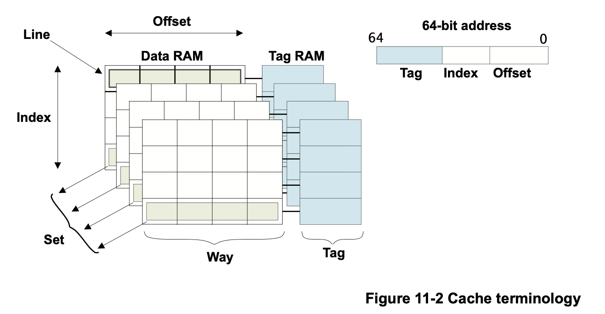

# Cache

## Introduction

A cache is a small, fast block of memory that sits between
the core and main memory. It holds copies of items in main memory.

Accesses to the cache memory occur significantly faster than those
to main memory. Whenever the core reads or writes a particular address,
it first looks for it in the cache.

If it finds the address in the cache, it uses the data in the cache,
rather than performing an access to main memory. This significantly
increases the potential performance of the system, by reducing the
effect of slow external memory access times. It also reduces the
power consumption of the system, by avoiding the need to drive
external signals.

Processors that implement the ARMv8-A Architecture are usually
implemented with two or more levels of cache.

This typically means that the processor has small
**L1 Instruction and Data caches** for **each core**.

The Cortex-A53 and Cortex-A57 processors are normally implemented
with two or more levels of cache, that is a small L1 Instruction
and Data cache and a larger, **unified L2 cache**, which is
**shared between multiple cores in a cluster**.

Additionally, there can be an **external L3 cache** as an external
hardware block, **shared between clusters**.


## D-cache and I-cache

In a von Neumann architecture, a single cache is used for instruction
and data (a unified cache). A modified Harvard architecture has separate
instruction and data buses and therefore there are two caches, an
instruction cache (I-cache) and a data cache (D-cache).

In the ARMv8 processors, there are distinct instruction and data L1
caches backed by a unified L2 cache.


## Fundamental structure of a cache



* A **tag** is the part of a memory address stored within the cache that
  identifies the main memory addr associated with a line of data
* **cache line** refers to the smallest loadable unit of a cache, a block
  of contiguous words from main memory
* A **way** is a subdivision of a cache, each way being of equal size and
  indexed in the same fashion.
* A **set** consists of the cache lines from all ways sharing a particular
  index


## Inclusive cache and Exclusive cache

In an **inclusive cache model**, where the same data can be present
in both the L1 and L2 caches.

In an **exclusive cache**, data can be present in only one cache and
an address cannot be found in both the L1 and L2 caches at the same time.


## Cache policies

The cache policies enable us to describe when a line should be allocated
to the data cache and what should happen when a store instruction is
executed that hits in the data cache.

### Cache allocation policies

* Write allocation
* Read allocation

### Cache update policies

* Write-back
* Write-through


## Shareability memory attributes

Memory caching can be separately controlled through *inner* and *outer*
attributes, for multiple levels of cache.

The shareable attribute is used to define **whether a location is shared**
**with multiple cores**.

Marking a region an **Non-shareable** means it is only used by thie core,
whereas marking it as **inner shareable** or **outer shareable**, or both, means
that the location is shared with other observers, for example, a GPU or
DMA device might be considered another observer.

* Non-shareable

This represents memory accessible only by a single processor or other
agent, so memory accesses never need to be synchronized with other
processors. This domain is not typically used in SMP systems.

* Inner shareable

This represents a shareability domain that can be **shared by multiple**
**processors**, but not necessarily all of the agents in the system.

A system might have multiple Inner Shareable domains. An operation that
affacts one Inner Shareable domain does not affect other Inner Shareable
domains in the system.

* Outer shareable

An outer shareable domain re-orderis shared by multiple agents and
can consist of one or more inner shareable domains. An operation
that affects an outer shareable domain also implicity affects all
inner shareable domains inside it.

Howevert, it does not otherwise behave as an inner shareable operation.

* Full system

An operation on the full system (SY) affects all observers in the system.


## Cache Coherency

Cache introduce a number of potential problems, mainly because:
* Memory accesses can occur at times other than when the
  programmer would expect them
* A data item can be held in multiple physical locations


### MESI protocol

Cache line can be marked with one of

* M(modified): present only in the current cache, and is dirty.
* E(exclusive): present only in the current cache, but is clean.
* S(shared): indicates that this cache line may be stored in other caches
  of the machine and is clean.
* I(invalid): indicates that this cache line is invalid.


## TLB

### ASID and VMID

To reduce the need for TLB maintanance on context switches, the lookups from
some translation regimes can be associated with an ASID, or with an ASID
and a VMID.

#### ASID

For stage 1 of a translation regime that can support two VA ranges
the VMSA can distinguish between Global pages and Process-specific
pages. The ASID identifies pages associated with a specific process
and provides a mechanism for changing process-specific tables without
having to maintain the TLB structures.

In Linux, asid has type `u64`. The highest bits[63:asid_bits] is generation
number, [asid_bits:0] is asid number which managed by a bitmap.

If bits of bitmap are used up, Linux will increment generation and clear
the bitmap.

For stage 1 translations, each of `TTBR0_ELx` and `TTBR1_ELx` has a valid
ASID field, and `TCR_ELx`.A1 determines which of these holds the current
ASID.

The significant 16 bits are used to store an ASID.

##### init bitmap

bits of ASID is 8 or 16. Linux uses bitmap to manage ASID allocation.

```c
static int asids_init(void)
{
        asid_bits = get_cpu_asid_bits();
        /*
         * Expect allocation after rollover to fail if we don't have at least
         * one more ASID than CPUs. ASID #0 is reserved for init_mm.
         */
        WARN_ON(NUM_USER_ASIDS - 1 <= num_possible_cpus());
        atomic64_set(&asid_generation, ASID_FIRST_VERSION);
        asid_map = kcalloc(BITS_TO_LONGS(NUM_USER_ASIDS), sizeof(*asid_map),
                           GFP_KERNEL);
        if (!asid_map)
                panic("Failed to allocate bitmap for %lu ASIDs\n",
                      NUM_USER_ASIDS);

        pr_info("ASID allocator initialised with %lu entries\n", NUM_USER_ASIDS);
        return 0;
}
early_initcall(asids_init);
```

##### Allocate context for task

```c
static u64 new_context(struct mm_struct *mm)
{
        static u32 cur_idx = 1;
        u64 asid = atomic64_read(&mm->context.id);
        u64 generation = atomic64_read(&asid_generation);

        if (asid != 0) {
                u64 newasid = generation | (asid & ~ASID_MASK);

                /*
                 * If our current ASID was active during a rollover, we
                 * can continue to use it and this was just a false alarm.
                 */
                if (check_update_reserved_asid(asid, newasid))
                        return newasid;

                /*
                 * We had a valid ASID in a previous life, so try to re-use
                 * it if possible.
                 */
                if (!__test_and_set_bit(asid2idx(asid), asid_map))
                        return newasid;
        }

        /*
         * Allocate a free ASID. If we can't find one, take a note of the
         * currently active ASIDs and mark the TLBs as requiring flushes.  We
         * always count from ASID #2 (index 1), as we use ASID #0 when setting
         * a reserved TTBR0 for the init_mm and we allocate ASIDs in even/odd
         * pairs.
         */
        asid = find_next_zero_bit(asid_map, NUM_USER_ASIDS, cur_idx);
        if (asid != NUM_USER_ASIDS)
                goto set_asid;

        /* We're out of ASIDs, so increment the global generation count */
        generation = atomic64_add_return_relaxed(ASID_FIRST_VERSION,
                                                 &asid_generation);
        flush_context();

        /* We have more ASIDs than CPUs, so this will always succeed */
        asid = find_next_zero_bit(asid_map, NUM_USER_ASIDS, 1);

set_asid:
        __set_bit(asid, asid_map);
        cur_idx = asid;
        return idx2asid(asid) | generation;
}
```

##### switch asid

```c
void check_and_switch_context(struct mm_struct *mm, unsigned int cpu)
{
        unsigned long flags;
        u64 asid, old_active_asid;

        if (system_supports_cnp())
                cpu_set_reserved_ttbr0();

        asid = atomic64_read(&mm->context.id);

        /*
         * The memory ordering here is subtle.
         * If our active_asids is non-zero and the ASID matches the current
         * generation, then we update the active_asids entry with a relaxed
         * cmpxchg. Racing with a concurrent rollover means that either:
         *
         * - We get a zero back from the cmpxchg and end up waiting on the
         *   lock. Taking the lock synchronises with the rollover and so
         *   we are forced to see the updated generation.
         *
         * - We get a valid ASID back from the cmpxchg, which means the
         *   relaxed xchg in flush_context will treat us as reserved
         *   because atomic RmWs are totally ordered for a given location.
         */
        old_active_asid = atomic64_read(&per_cpu(active_asids, cpu));
        if (old_active_asid &&
            !((asid ^ atomic64_read(&asid_generation)) >> asid_bits) &&
            atomic64_cmpxchg_relaxed(&per_cpu(active_asids, cpu),
                                     old_active_asid, asid))
                goto switch_mm_fastpath;

        raw_spin_lock_irqsave(&cpu_asid_lock, flags);
        /* Check that our ASID belongs to the current generation. */
        asid = atomic64_read(&mm->context.id);
	// the generation of the asid is not matched with global generation,
	// we generate a new asid
        if ((asid ^ atomic64_read(&asid_generation)) >> asid_bits) {
                asid = new_context(mm);
                atomic64_set(&mm->context.id, asid);
        }

        // invalidate TLB for current CPU
        if (cpumask_test_and_clear_cpu(cpu, &tlb_flush_pending))
                local_flush_tlb_all();

        atomic64_set(&per_cpu(active_asids, cpu), asid);
        raw_spin_unlock_irqrestore(&cpu_asid_lock, flags);

switch_mm_fastpath:

        arm64_apply_bp_hardening();

        /*
         * Defer TTBR0_EL1 setting for user threads to uaccess_enable() when
         * emulating PAN.
         */
        if (!system_uses_ttbr0_pan())
                cpu_switch_mm(mm->pgd, mm);
}
```

#### VMID

When EL2 is enabled, the VMID identifies the current virtual machine,
with its own independent ASID space.

## Conceptual points

* Point of Unification (PoU)
* Point of Coherency (PoC)
* Point of Persistence (PoP)
* Point of Persistence (PoDP)


## Cache maintenance

* Clean: causes the contents of the cache line to be writtern back
  to memory, but only if the cache line is 'dirty'
* invalidate: simply marks a cache line as 'invalid', meaning you
  won't hit upon

* Cache clean by virtual address, `DC CVAC`, `DC CVAP`, and `DC CVAU`
* Cache invalidate by virtual address, `DC IVAC`
* Cache clean and invalidate by virtual address, `DC CIVAC`

### flush icache

`__flush_icache_range` and `__flush_cache_user_range` are used to
flush icache.

### flush dcache

`__flush_dcache_area` clean and invalidate cache (kaddr, size).

```c
/*
 *      __flush_dcache_area(kaddr, size)
 *
 *      Ensure that any D-cache lines for the interval [kaddr, kaddr+size)
 *      are cleaned and invalidated to the PoC.
 *
 *      - kaddr   - kernel address
 *      - size    - size in question
 */
ENTRY(__flush_dcache_area)
        dcache_by_line_op civac, sy, x0, x1, x2, x3
        ret
ENDPIPROC(__flush_dcache_area)
```
