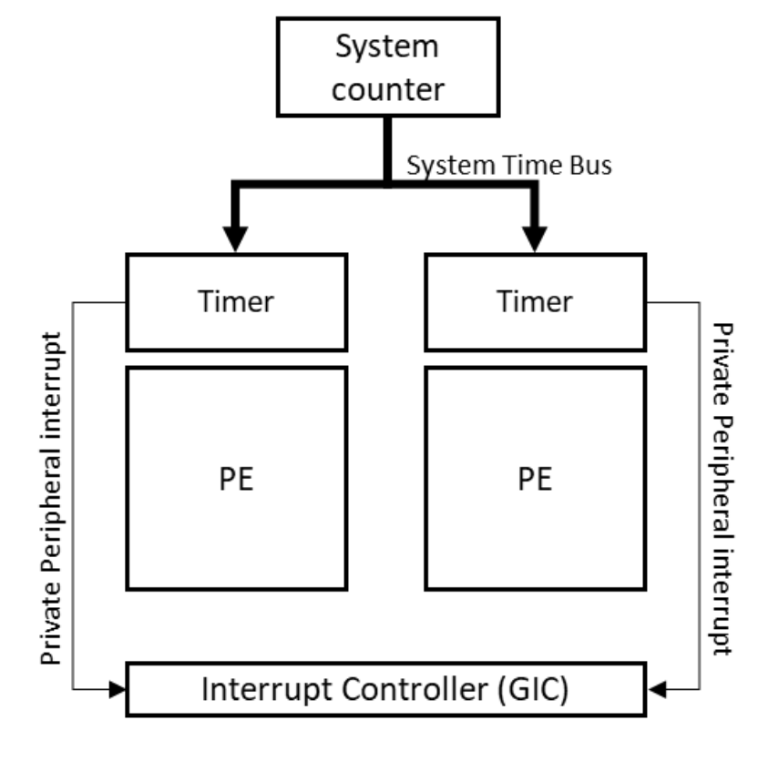

# Timer on ARM

## Introduction

::: tip
The Generic Timer only measures the passage of time. It
does not report the time or date. Usually, an SoC would
also contain a Real-Time Clock (RTC) for time and date.
:::

## Generic Timer

Each core has a set of timers.

## System Counter

The System Counter generates the system count value that is
distributed to all the cores in the system, as shown in the
following diagram:



The System Counter is an always-on device, which provides a
fixed frequency incrementing system count. The system count
value is broadcast to all the cores in the system, giving
the cores a common view of the passage of time. The system
count value is between 56 bits and 64 bits in width, with a
frequency typically in the range of 1MHz to 50MHz.

```c
// drivers/clocksource/arm_arch_timer.c
static struct clocksource clocksource_counter = {
        .name   = "arch_sys_counter",
        .rating = 400,
        .read   = arch_counter_read,
        .mask   = CLOCKSOURCE_MASK(56),
        .flags  = CLOCK_SOURCE_IS_CONTINUOUS,
};
```

## External timers

A system can also contain additional external timers.

## Reference

* AArch64 Programmer's Guides Generic Timer