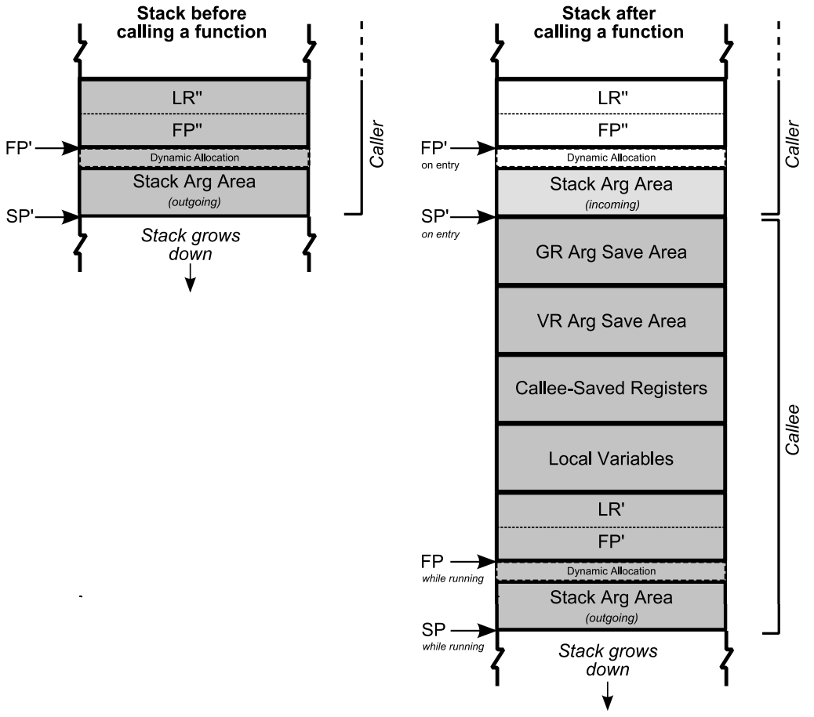

# Walk stack on ARM

## fp register



## walk_stackframe

```c
struct stackframe {
        unsigned long fp;
        unsigned long pc;
#ifdef CONFIG_FUNCTION_GRAPH_TRACER
        int graph;
#endif
};
```

```c
void notrace walk_stackframe(struct task_struct *tsk, struct stackframe *frame,
                     int (*fn)(struct stackframe *, void *), void *data)
{
        while (1) {
                int ret;

                if (fn(frame, data))
                        break;
                ret = unwind_frame(tsk, frame);
                if (ret < 0)
                        break;
        }
}

int notrace unwind_frame(struct task_struct *tsk, struct stackframe *frame)
{
        unsigned long fp = frame->fp;

        if (fp & 0xf)
                return -EINVAL;

        if (!tsk)
                tsk = current;

        if (!on_accessible_stack(tsk, fp, NULL))
                return -EINVAL;

        frame->fp = READ_ONCE_NOCHECK(*(unsigned long *)(fp));
        frame->pc = READ_ONCE_NOCHECK(*(unsigned long *)(fp + 8));

#ifdef CONFIG_FUNCTION_GRAPH_TRACER
        if (tsk->ret_stack &&
                        (frame->pc == (unsigned long)return_to_handler)) {
                struct ftrace_ret_stack *ret_stack;
                /*
                 * This is a case where function graph tracer has
                 * modified a return address (LR) in a stack frame
                 * to hook a function return.
                 * So replace it to an original value.
                 */
                ret_stack = ftrace_graph_get_ret_stack(tsk, frame->graph++);
                if (WARN_ON_ONCE(!ret_stack))
                        return -EINVAL;
                frame->pc = ret_stack->ret;
        }
#endif /* CONFIG_FUNCTION_GRAPH_TRACER */

        /*
         * Frames created upon entry from EL0 have NULL FP and PC values, so
         * don't bother reporting these. Frames created by __noreturn functions
         * might have a valid FP even if PC is bogus, so only terminate where
         * both are NULL.
         */
        if (!frame->fp && !frame->pc)
                return -EINVAL;

        return 0;
}
```

Key:

Reads LR register to get the pc of the previous frame.

```c
        frame->pc = READ_ONCE_NOCHECK(*(unsigned long *)(fp + 8));
```